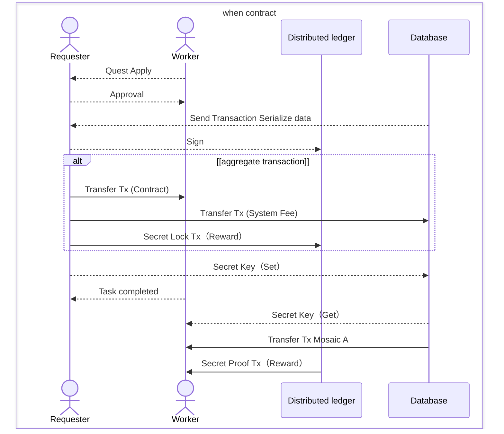

# Decentralized-Guild

API 側

1. notification クリック時に開く URL の調整（直接飛ぶように）
2. メール送信機能追加（ メールサーバー不要のもので ）
3. SecretLock 解除用 transaction QR 再取得用 API の追加
4. 退会時、対応中 Quest や募集中クエストがあったら退会できない処理

UI 側

1. Page コンポーネントの削除
2. キャンセル関連のボタンはいらないのでは。（クエストを受けますか？No みたいな。もしくは Yes を contain No を Outline
3. Modal ウィンドウを基本すりガラスにしてしまう
4. Quest の提案（提案内容作成画面が必要）
5. クエスト申込時に requester に通知する
6. Quest の詳細表示は /quest/details/[questId]
7. requester がマイページで quest の申込者一覧を表示して対応者を決める
8. 申込者へ受注通知を行い、かつ契約書をチェーンに格納する
9. 契約完了、納品画面の作成
10. 契約完了をチェーンに格納する

# Symbol を ID としての活用

- Session 回りの構築負荷軽減としてログイン自体には SNS ログインを利用する
- ただし、クエストに対するアクセス権限や記録に Symbol Public Key を用い、Decentralized Guild を他事業者が起動した際に、ログイン ID が異なっても同一人物か判定可能な実装とする

# 何を改善するか

- 頑張る人が正しく評価される状態を目指す
- 短時間で大きく収益を挙げるより長期間コンスタントに NW 上で活動する人々を評価する
- また、ギルドプログラムの中で評価ポイントを導入しポイントを得る事を促す
- 古参が有利になりすぎるため、バディプログラムとしてマルチシグで古参者と組み、一定期間 RPT を底上げ可能とする
- 元老院システムの構築

## 各ポイントの取り扱い

**RPT** アカウントに対して RPT TOKEN を報酬額に応じて案件達成時に付与する
**GPT** ギルドアカウントに対して GPT TOKEN を報酬額に応じて案件達成時に付与する

## 各種コントラクトフロー

System account が署名をしなければ模倣アカウントとの区別がややこしい
Secret Lock の送信先を２箇所にできない？

